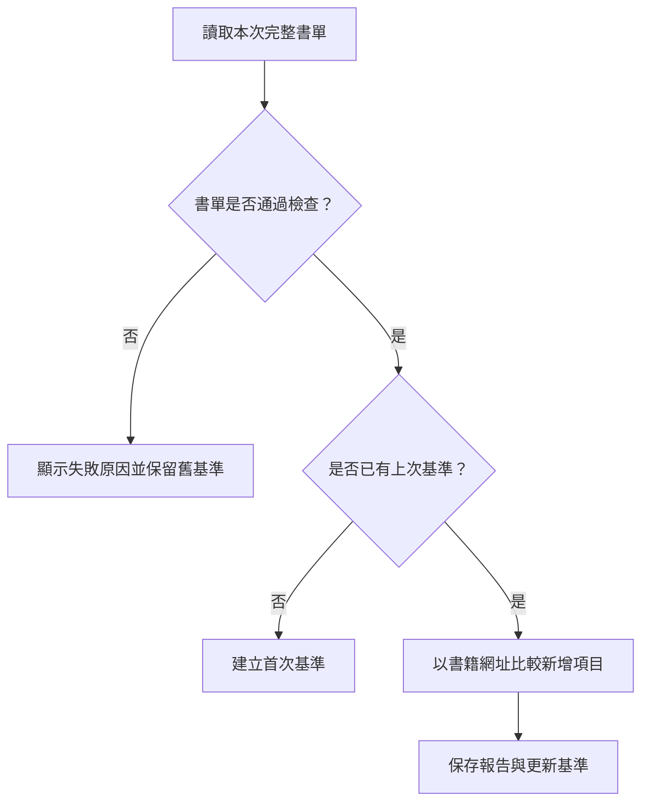

# 第 1 章　認識 Playwright：讓瀏覽器替你完成日常工作

打開電子書網站、點選書籍列表、選擇分類，再往下尋找新書，可能只需要幾分鐘。但隔了幾天，你未必記得上次看到哪一本。於是，「看看今天有哪些書」逐漸變成「整理一份可以和上次比較的書單」。

這個需求包含兩件事：取得今天的資料，以及保留足夠的紀錄，讓下一次有東西可以比較。本章會用這個例子說明自動化的組成，並帶你把自己的需求寫成可以實作的規格。

本章不需要安裝軟體，也不需要先執行程式。完成後，你應能分辨瀏覽器操作與直接資料請求，知道 16 個案例的用途，並寫出一項任務的輸入、步驟、輸出和完成條件。安裝與第一次執行安排在第 2、3 章。

## 1.1　Python 與 Playwright 各自負責什麼

在本書的案例中，Python 負責安排工作順序與處理資料，例如把每一本書整理成字典、比較兩次查詢結果，再寫成 JSON 或 HTML 報告。Playwright 則提供瀏覽器操作介面，讓 Python 可以開啟頁面、找到元素、輸入內容和讀取畫面資料。

Playwright 原本著重於端到端測試，也能作為一般瀏覽器自動化函式庫；Python 介面提供同步與非同步兩種寫法。本書現有範例主要採同步寫法，方便初學者依序閱讀操作步驟。官方支援 Chromium、Firefox 與 WebKit；本書的瀏覽器實作主要使用 Chromium。參考 [Playwright 官方介紹](https://playwright.dev/python/docs/intro)。

你可以把「取得 AI Agent 書單」拆成以下工作：

| 工作 | 本書案例如何處理 |
|---|---|
| 開啟網站並切換分類 | Playwright 操作網頁 |
| 展開尚未顯示的書籍 | Playwright 找到按鈕、點擊並等待書卡出現 |
| 整理書名和網址 | Python 建立清單與字典 |
| 保存查詢結果 | Python 將資料寫成 JSON |

這些步驟仍需要由你定義。若需求只是「找新書」，程式還不知道「新」是指最近出版、第一次出現在網站，還是和上次查詢相比新增。定義清楚之後，才有辦法選擇資料與比較方法。

## 1.2　從點擊流程走向資料流程

假設今天的書單有甲、乙、丙三本，下次查詢變成甲、乙、丙、丁四本。只要你保留了今天的書單，下次就能找出新增的丁。若第一次執行時沒有舊資料，合理的結果是「建立基準」，而不是宣稱這三本都是剛出版的新書。

下面是新書雷達的概念流程：

這個流程有一個重要的選擇：當資料沒有讀完整時，先停止。假如網站暫時只載入十本書，卻把它當成完整書單存下來，下次就可能把原本存在的書誤判為新增。第 10 章會在實際程式中處理這個問題。

對應程式是 [E12：新書雷達](../../examples/04_tracking/happyebook_new_books.py)。現在可以先知道它的位置，不必逐行閱讀。後續章節會說明如何判斷完整書單、如何使用網址辨識一本書，以及比對結果存在哪裡。

## 1.3　有些工作需要瀏覽器，有些可以直接取得資料

查詢臺鐵班次時，本書範例會開啟時刻表頁面、選擇站點與時間，再讀取結果。這類工作需要處理表單和頁面上的狀態。

AI 新聞案例則讀取 RSS 資料。RSS 是供程式讀取的結構化內容，其中包含新聞標題、連結與時間等欄位。這個案例不需要先將新聞網站畫面顯示出來，再從畫面找出同樣的資訊。

Playwright 的 `APIRequestContext` 可以直接發送 HTTP 請求，不必載入網頁並執行頁面 JavaScript。本書的新聞與行情案例採用這種方式。參考 [Playwright API testing 文件](https://playwright.dev/python/docs/api-testing)。

| 需求 | 本書採用的方式 | 判斷重點 |
|---|---|---|
| 查詢臺鐵或高鐵班次 | 瀏覽器操作 | 必須填寫表單並取得完整結果 |
| 拍攝手機與電腦版畫面 | 瀏覽器操作 | 需要實際呈現網頁 |
| 取得今日 AI 新聞 | 直接請求 RSS | 資料來源已有標題、連結與日期欄位 |
| 追蹤台積電行情 | 直接請求行情資料 | 需要檢查來源日期、成交價與行情時間 |

選擇方法時，先確認資料來源提供什麼，再決定程式如何讀取。來源介面也可能改變；直接請求同樣需要驗證回應，不能把「收到資料」直接等同於「取得正確答案」。

## 1.4　認識瀏覽器、工作階段與分頁

後續程式會反覆出現三個名稱：`browser`、`context` 和 `page`。

`browser` 代表瀏覽器實例；`context` 是瀏覽器中的獨立工作階段；`page` 通常對應其中的一個分頁。一個工作階段可以有多個分頁。不同工作階段可隔離 Cookie 等資料，因此新建立的工作階段不會自動沿用你平常 Chrome 的登入狀態。參考 [Playwright Isolation 文件](https://playwright.dev/python/docs/browser-contexts)。

這能解釋一個常見問題：「我明明已經登入，為什麼程式又顯示登入頁？」首先要確認程式啟動的是哪一個瀏覽器，以及它使用哪個工作階段。第 8 章會再介紹如何連接既有 Chrome，以及這種方式需要哪些設定。

另一個常見現象是程式正在執行，卻沒有出現瀏覽器視窗。瀏覽器可以在不顯示視窗的模式下執行，通常稱為 headless 模式；它仍然可以載入頁面和擷取資料。相對地，顯示視窗的模式方便觀察操作。直接發送 HTTP 請求的案例則沒有瀏覽器畫面可看，應從終端機和輸出資料確認結果。

## 1.5　先知道結果會放在哪裡

本書將正式範例放在 `examples/`，操作指南放在 `docs/guides/`，執行後的資料集中在 `outputs/`。這樣你可以分清楚哪些是程式來源，哪些是每次執行產生的結果。

| 常見輸出 | 適合做什麼 |
|---|---|
| JSON | 保留結構化資料，供下次程式讀取 |
| CSV | 使用試算表查看與整理查詢結果 |
| HTML | 在瀏覽器中閱讀報告 |
| PNG | 保存截圖 |
| SQLite 資料庫 | 累積多次查詢的紀錄 |

有些輸出同時也是下一次執行的輸入。新書雷達的基準和股價追蹤的資料庫，就是這類資料。刪除後，程式可能需要重新建立紀錄，所以請先看操作指南，再決定哪些檔案可以清理。

## 1.6　選擇你的第一個應用

若你想很快看見結果，可以從多尺寸截圖開始；若你想練習讀取與整理資料，可以從書籍清單開始；若你想知道如何做持續追蹤，可以接著學新書雷達。

交通、行情與活動案例適合練習時間條件。例如，「今天」需要明確的時區；「開盤漲最多」需要說明比較的是開盤價與昨收價；「可以報名」需要區分看見報名入口和真正完成報名。這些定義會直接影響結果的意義。

內容發布案例安排在最後。查詢程式主要讀取資料，發布程式則會改動網站上的內容。學習時應先理解每一步的效果，再設定自己的帳號與執行條件。

完整清單可由 [16 例索引](../../docs/example-index.md) 查閱。你不需要一次完成全部案例；先選一個自己能核對結果的任務，做完後再逐步擴展。

## 1.7　練習：把需求寫成可以檢查的規格

請拿你想自動化的一件事，填入下面五項。以下以新書雷達作示範，書名與數量均是假設資料。

| 項目 | 示範答案 |
|---|---|
| 目的 | 找出相較上次新增的書籍 |
| 輸入 | 書單網址與上次保存的基準 |
| 步驟 | 取得完整列表、檢查內容、比較網址、保存結果 |
| 輸出 | 新增書名與連結，以及本次查詢時間 |
| 完成條件 | 完整讀取才更新基準；第一次建立基準；失敗時明確說明原因 |

接著回答三個問題：

1. 第一次執行，沒有舊資料時，應該顯示什麼？
2. 網站載入失敗時，應該回報「沒有新資料」，還是「查詢失敗」？
3. 下次需要比較時，哪些檔案必須保留？

以本章的新書雷達為例，答案分別是「建立首次基準」、「回報查詢失敗」與「保留比較基準」。如果你能對自己的任務回答這三題，就已經有一份足以開始實作的需求描述。

下一章將建立 Python 與 Playwright 開發環境。安裝完成後，我們會從開啟網頁、印出標題開始，逐步把這份需求變成程式。

<!-- 編輯紀錄：初稿；2026-09-17 核對官方介紹、API testing、Isolation 文件與專案 E01/E12 原始碼。本章為概念與紙上練習，沒有宣稱重新執行外站範例。流程圖依現有新書雷達成功／失敗與基準分支整理；電子書轉檔時需另渲染 Mermaid。 -->
